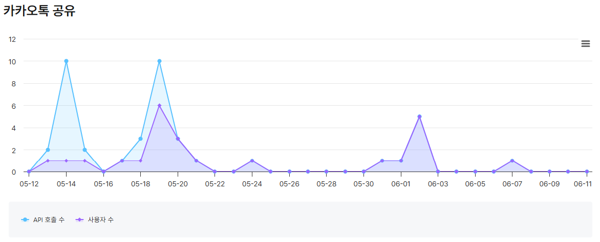
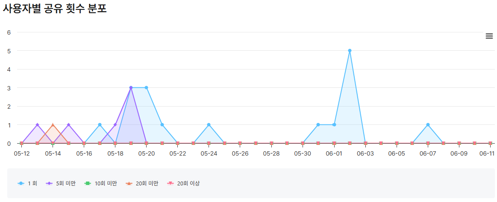
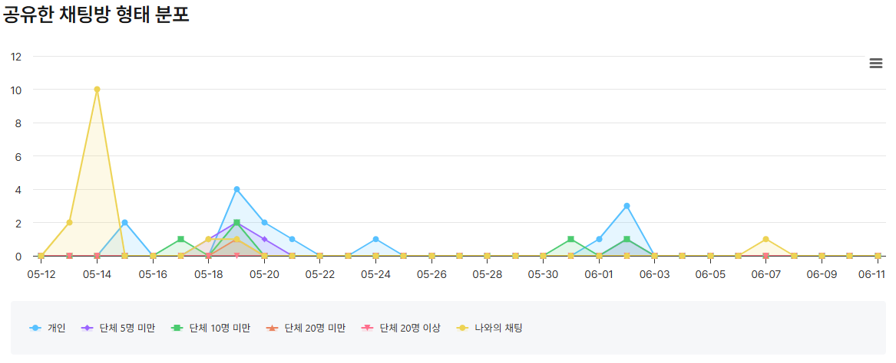

# 2026 하나로 가족 한마당 · 초대장

> 하나로교회 **아멘 17기**가 준비하여 진행한 **2026 하나로 가족 한마당**의 모바일 초대장 웹앱.

- 📅 **일시** — 2026.06.03 (수) 09:00 ~ 16:00 *(성황리에 종료)*
- 📍 **장소** — 김포골드밸리 중앙체육공원
- 🌐 **배포** — https://2026hanarofamilyfestival.vercel.app

> ✅ **행사 종료** — 2026년 6월 3일 행사가 무사히 마무리되었습니다. 본 리포지터리는 현장에서 사용된 모바일 초대장의 최종 코드와 아카이브입니다.

세로 스크롤로 11개 섹션을 흘려보며 행사 정보를 전달하는 단일 페이지 초대장. 모바일 디바이스 프레임 톤의 풀-뷰포트 레이아웃, MorphingWave SVG와 Timeline의 햇님 애니메이션, 실시간 응원 카운터(Redis), 카카오톡 공유, Pull-to-Refresh 까지 모바일 인터랙션 위주로 설계되어 있습니다.

---

## 기술 스택

| 영역 | 라이브러리 |
|---|---|
| Build/Dev | Vite 8 |
| UI | React 19 + TypeScript 6 |
| Server | Vercel Serverless Functions (`@vercel/node`) |
| Realtime store | Redis Cloud (node-redis v5) |
| External | Kakao JavaScript SDK (Maps + Share) |
| Icons | lucide-react |
| Fonts | Pretendard · Bebas Neue · Black Han Sans · Gowun Batang |
| Lint | typescript-eslint, eslint-plugin-react-hooks |

런타임 의존성은 의도적으로 얇게 유지(`react`, `react-dom`, `redis`, `lucide-react` 4개). 라우터·상태관리 라이브러리 없이 자체 ScrollContext + 컴포넌트 메모이제이션으로 처리.

---

## 섹션 구조 (11 sections)

스크롤 컨테이너 안에 풀-뷰포트 섹션이 차례로 쌓이는 구조. 각 섹션은 `data-screen-label="NN ..."` 속성을 가지며, IssueLabel 컴포넌트로 번호+레이블이 표시됩니다.

| # | 섹션 | 핵심 요소 |
|---|---|---|
| 01 | **Hero** | 타이틀 · `함께 만드는 특별한 하루` · SWIPE UP 힌트(아래로 드래그) |
| 02 | **Invite** | 초대 글, pullQuote, signature |
| 03 | **When · Where** | 날짜/시간, 미니 캘린더, 카카오맵, 외부 지도 앱 링크 |
| 04 | **Timeline** | 16개 행사 진행표 (오프닝/오전/오후/폐막), 스크롤 진행에 따라 배경이 paper → dusk로 변하고 햇님(`TimelineSun`)이 우상단에서 wave로 안착 |
| 05 | **Awards** | 행운의 축복상 — 1등 hero 카드(전기 자전거)에 sun shimmer + 시상대 받침 그래픽, 그 외 4종 2×2 grid |
| 06 | **Kids Prizes** | 유·초등부 스탬프 부스 보상 — 대상/규칙 안내 박스 + 1~6등 tier 카드 리스트. 1·2·3등은 메달 톤(sun/ocean/dusk) 강조 |
| 07 | **Program** | 3행(전연령/초등부/유아부) 무한 가로 캐러셀, 카드 클릭 시 모달로 상세 |
| 08 | **Food** | 점심 / 간식 두 그룹 |
| 09 | **Gallery** | 지난 행사 사진 6슬롯. 각 슬롯이 독립 랜덤 스케줄로 크로스페이드. `Image.decode()`로 잔상 방지. YouTube 영상 CTA |
| 10 | **Directions** | 셔틀버스 + 주차 정보 |
| 11 | **RSVP** | 실시간 응원 카운터(CheerBoard), 카피라이트 + 크레딧 |

스크롤과 무관하게 떠 있는 부유 요소:

- **TimelineSun** — Timeline 섹션 진입 시 우상단에 pop-in. section.top이 viewport.top에 닿은 순간부터 viewport 내부에서 하강하여 wave 위에 잠긴 채 정착, 섹션이 화면 밖으로 빠질 때 함께 사라짐.
- **ProgressRail** — 좌측 세로 진행 바.
- **ShareFAB** — 우하단 글래스모피즘 공유 버튼. 클릭 시 바텀시트(링크 복사 / 카카오톡 공유), 핸들 드래그로 닫기.
- **PullToRefresh** — 페이지 최상단에서 아래로 당기면 글래스모피즘 인디케이터가 따라 내려오고 임계점 이상에서 손 떼면 새로고침.

---

## 폴더 구조

```
2026_hanaro_family_festival/
├── FE/                                 # 프론트엔드(Vite + Vercel)
│   ├── api/
│   │   └── cheer.ts                    # GET/POST /api/cheer (Redis Cloud)
│   ├── public/
│   │   ├── cards/                      # Program 카드 이미지
│   │   ├── foods/                      # Food 섹션 이미지
│   │   ├── gallery/                    # Gallery 이미지 21장
│   │   └── icons/                      # 공유용 thumbnail 등
│   ├── src/
│   │   ├── App.tsx                     # 11 섹션 조립 + ScrollContext + 부유 요소
│   │   ├── main.tsx
│   │   ├── index.css                   # 글로벌 + 모든 키프레임 정의
│   │   ├── theme/tokens.ts             # WL(색상), FF(폰트) 디자인 토큰
│   │   ├── data/
│   │   │   ├── types.ts                # ConceptD 타입
│   │   │   └── concept-d.ts            # 모든 정적 콘텐츠 데이터
│   │   ├── hooks/
│   │   │   ├── useScrollTracker.ts     # 단일 rAF throttle + subscribe API
│   │   │   ├── useReveal.ts            # IntersectionObserver 기반 등장 감지
│   │   │   └── usePrefersReducedMotion.ts
│   │   ├── components/
│   │   │   ├── sections/               # 11개 섹션
│   │   │   └── common/                 # 재사용 컴포넌트 (CheerBoard, KakaoMap, ShareFAB, ...)
│   │   └── utils/
│   │       ├── kakaoMap.ts             # Kakao Maps SDK 로더 + Geocoder 훅
│   │       ├── kakaoShare.ts           # Kakao Share SDK 로더 + sendDefault
│   │       └── mapLinks.ts             # 외부 지도/내비 앱 딥링크
│   ├── index.html
│   ├── vite.config.ts
│   ├── tsconfig*.json
│   └── package.json
├── FE-legacy/                          # 컨셉 탐색 단계 정적 HTML 프로토타입
└── 2026 하나로 가족 한마당 수정안/      # 행사 운영팀 원본 자료
```

---

## 주요 컴포넌트 노트

### `useScrollTracker` (`src/hooks/useScrollTracker.ts`)
- 스크롤 컨테이너 1곳에 단일 listener를 달고 rAF로 한 프레임당 한 번만 update.
- `scrollPxRef` (ref) + `progress` (state) 둘로 노출 → 잦은 갱신은 ref, ProgressRail 같은 UI는 state.
- `subscribe(cb)` API로 추가 구독자(TimelineSun, Timeline 자체의 dayProg, PullToRefresh) 등록.

### `CheerBoard` (`src/components/common/CheerBoard.tsx`)
RSVP 섹션 핵심. 한 명이 5개 이모지(🙏 🙌 ❤️ 👍 🎉) 각각 독립 토글하여 응원을 누적하는 카운터.

- **데이터 흐름** — 마운트 시 `GET /api/cheer` 로 초기 카운트, 이후 2초마다 폴링(IntersectionObserver + visibilitychange로 가드).
- **낙관적 업데이트** — 탭 즉시 클라이언트 카운트 +1/−1, 동시에 `POST /api/cheer {from, to}`. 응답 도착 시 서버 카운트로 보정. 폴링은 `pendingPostsRef > 0` 동안 스킵하여 race 방지.
- **다중 선택** — `activeSet: Set<EmojiKey>`를 localStorage(`hanaro_cheer_active`)에 JSON 배열로 저장. 레거시 단일-키 포맷도 fallback 파싱.
- **버튼 cooldown** — 같은 버튼은 1초간 ref 기반 재발사 무시.
- **마일스톤 셀러브레이션** — `[50, 100, 200, 300, 400, 500, 603]` 도달 시 토스트(쌓이며 위로 떠올라 페이드아웃) + 이모지 비. 603은 5초 + 30개, 그 외는 15개. 첫 진입 시 retrospective 시퀀스로 한 번에 다 보여주고, 이후엔 `previousTotalRef`로 라이브 크로싱 감지하여 새로 넘은 마일스톤만 발사.
- **진행 바** — 0 → 현재값으로 채워지는 transition. 셀러브레이션 중엔 길게(staggered to per-milestone), 이후엔 0.8s 라이브 모드. sun → ocean 그라데이션, 흰 테두리 + 글래스 톤.

### `TimelineSun` (`src/components/common/TimelineSun.tsx`)
- Phase 1 (섹션 진입): sun이 section.top + `START_TOP`에 붙어 함께 위로 이동.
- Phase 2 (section.top이 viewport.top 통과): smoothstep으로 viewport 내부에서 하강. `Math.min(descendingY, waveTargetY)`로 wave와 만나면 wave에 고정되어 함께 위로 빠짐. 도착 깊이는 `LANDING_OVERLAP`으로 조절.
- 광선/halo는 phase 2 진행도에 따라 페이드.

### `Gallery` (`src/components/sections/Gallery.tsx`)
- 6 슬롯 각각 독립 랜덤 스케줄(초기 0~4.5초, 인터벌 4~7.5초 랜덤).
- 부모가 `slotImages: number[]`을 단일 source of truth로 보유 → 슬롯이 `requestNext`를 부르면 현재 사용 중인 인덱스 집합을 빼고 후보에서 랜덤 추첨하여 동시 중복 차단.
- 슬롯 내부는 2-layer 크로스페이드. 새 src 적용 전 `new Image().decode()`로 미리 디코드 → 잔상 깜빡임 차단.

### `KakaoMap` (`src/components/common/KakaoMap.tsx`)
- `VITE_KAKAO_MAP_KEY` 로 SDK 동적 로드(`utils/kakaoMap.ts`).
- `concept-d.ts`의 `location.coords` 활용. 키 미설정 시 placeholder fallback.

### `ShareFAB` (`src/components/common/ShareFAB.tsx`)
- 항상 우하단에 떠 있는 글래스모피즘 FAB(`backdrop-filter: blur(14px) saturate(160%)`).
- 클릭 시 바텀시트 슬라이드업, 두 옵션:
  1. **링크 복사** — `navigator.clipboard.writeText()` → 토스트.
  2. **카카오톡 공유** — `utils/kakaoShare.ts`로 Kakao SDK 동적 로드, `Kakao.Share.sendDefault({objectType: 'feed', ...})`로 thumbnail.png feed 카드 전송.
- 핸들 드래그 다운으로 닫기 가능 (`onPointer*` + `setPointerCapture`).

### `PullToRefresh` (`src/components/common/PullToRefresh.tsx`)
모바일 브라우저의 네이티브 PTR이 동작 안 함 (내부 스크롤 컨테이너 구조 때문) → 커스텀 구현.
- `scrollTop === 0`일 때 `touchstart`로 시작, `touchmove`에서 dy / 2.4 만큼 시각적 당김 + 스크롤 컨테이너에 inline `transform: translateY` 직접 적용.
- 임계점(70px) 이상에서 손 떼면 spinner 표시 후 0.5초 뒤 `window.location.reload()`.

---

## API (`FE/api/cheer.ts`)

Vercel Serverless 함수 1개. 매 요청마다 Redis 클라이언트 connect → 사용 → quit (Vercel 짧은 라이프사이클에 적합).

| Method | Behavior |
|---|---|
| **GET** `/api/cheer` | 5개 이모지 카운트 `{counts: {pray, raised_hands, heart, thumbs_up, party}}` 반환 |
| **POST** `/api/cheer` | Body `{from: EmojiKey \| null, to: EmojiKey \| null}` — from 감소(0 미만 자동 보정) + to 증가. 변경된 전체 카운트 반환 |

키 형식: `cheer:<emojiKey>` 단순 INCR/DECR. 트랜잭션 없이 두 명령을 순차 실행해도 응원 카운터 도메인 특성상 일시 불일치 허용.

---

## 환경 변수

`FE/.env.local`에 정의 (배포는 Vercel Dashboard에 등록):

```env
VITE_KAKAO_MAP_KEY=...   # Kakao Developers JS키 (Maps + Share 공용)
REDIS_URL=redis://...    # Redis Cloud connection string
```

- `VITE_KAKAO_MAP_KEY`는 **카카오 개발자 콘솔에 배포 도메인이 등록된 JS키**여야 Maps와 Share 둘 다 동작합니다.
- `REDIS_URL`은 Vercel env에서 **Production + Preview** 환경에만 등록(개발 환경과 sensitive 변수 충돌 회피).

---

## 로컬 개발

```sh
cd FE
npm install
vercel env pull .env.local      # Vercel에서 환경 변수 가져오기
vercel dev                       # API 라우트 포함 dev 서버
# 또는 단순 프론트만:
npm run dev
```

- 빌드: `npm run build` (`tsc -b && vite build`)
- 린트: `npm run lint`
- 프로덕션 배포: `vercel --prod`

---

## 디자인 토큰 (`src/theme/tokens.ts`)

```ts
WL.ocean    = '#439BF5'   // 메인 파랑 (강조)
WL.aqua     = '#ABF7EE'   // 민트
WL.lime     = '#B9E68B'   // 라임
WL.sun      = '#FFC93C'   // 햇살 노랑
WL.ink      = '#0F2A3D'   // 짙은 네이비 (텍스트)
WL.paper    = '#F8F6F1'   // 크림 (배경)
WL.paperWarm= '#F1ECE3'   // 따뜻한 크림
WL.dusk     = '#C9956A'   // Timeline 폐막 시간대 골든브라운
```

폰트:

- `Bebas Neue` — 영문 caps, 라벨 (`FF.bebas`)
- `Black Han Sans` — 한글 헤드라인 (`FF.han`)
- `Gowun Batang` — 본문 강조 serif (`FF.serif`)
- `Pretendard` — 본문 sans (`FF.sans`)

---

## 모션 / 접근성

- `usePrefersReducedMotion` 으로 OS의 reduced-motion 설정 존중.
  - CheerBoard 셀러브레이션 시퀀스 스킵 (진행 바만 즉시 채움)
  - Reveal은 트랜지션 없이 즉시 visible
- 모든 부유 요소는 `pointer-events: none` 또는 인터랙션 영역만 활성화.

---

## 행사 후기

2026년 6월 3일 김포골드밸리 중앙체육공원에서 **2026 하나로 가족 한마당**이 성황리에 마무리되었습니다. 본 초대장은 행사 당일까지 운영팀의 요청을 반영하여 라이브로 업데이트되었으며, 모든 콘텐츠는 행사 종료 시점의 최종 상태로 아카이브되어 있습니다.

함께 만들어 주신 **하나로교회 가족 여러분**, **아멘 17기** 팀, **더드림** 후원, 그리고 현장에서 도와주신 모든 분들께 감사드립니다.

---

## 운영 통계

집계 기간: **2026-05-12 ~ 2026-06-11** (Redis 인스턴스 가동 31일 / 배포 ~ 행사 종료 후 9일).
사전에 Vercel Web Analytics를 붙이지 않아 페이지뷰는 측정되지 않았습니다. 아래는 Redis 카운터·서버 메트릭·카카오 디벨로퍼스 콘솔에서 회수한 수치입니다.

### 🎉 응원 카운터 (RSVP 섹션)

CheerBoard에서 사용자가 5개 이모지를 토글한 누적값. Redis `cheer:<emoji>` 키의 최종 상태.

| 이모지 | 의미 | 누적 카운트 |
|---|---|---|
| 🙏 | 기도 | 134 |
| 🙌 | 환호 | 130 |
| ❤️ | 사랑 | **179** |
| 👍 | 좋아요 | 142 |
| 🎉 | 축하 | 121 |
| | **합계** | **706** |

행사일을 기념하는 마일스톤 `603` (= 06.03) 돌파. ❤️가 단일 이모지 최다.

### 📤 카카오톡 공유 (Kakao Developers Console)

`utils/kakaoShare.ts` → `Kakao.Share.sendDefault({objectType: 'feed', ...})` 호출 통계.

- 누적 공유 API 호출 약 **40회**, 공유 사용자(일별 unique 합산) 약 **24명**
- 주요 푸시 시점
  - **05-19** (D-15): 6명이 10건 공유 — 첫 라운드
  - **06-02** (D-1): 5명이 5건 공유 — 행사 직전 마지막 알림
- 공유 대상 채팅방: 개인 약 35%, 단체방(10명~20명) 약 25%, 나와의 채팅 약 25% (이 중 05-14의 10건은 개발 단계 테스트)
- 행사 당일(06-03) 공유 0건 — 사람들이 이미 현장 참여 중

**전체 추이 (API 호출 수 vs 공유 사용자 수)**


**사용자별 공유 횟수 분포**


**공유 대상 채팅방 형태 분포**


### 🛰 Redis 서버 메트릭 (31일 누적)

| 지표 | 값 | 비고 |
|---|---|---|
| Server uptime | 31일 (2,720,043초) | 무중단 가동 |
| `/api/cheer` 호출 (`MGET`) | **1,996회** | GET 폴링 + POST 합산 |
| 응원 버튼 인터랙션 | **286회** | INCR 192 + DECR 94 |
| Serverless function 인보케이션 (`HELLO`) | 4,090회 | Vercel 함수 호출당 신규 connect |
| 누적 연결 수 | 54,431건 | Redis Cloud 내부 헬스체크 포함 |
| 누적 송신 트래픽 | 2.79 GB | |
| 누적 수신 트래픽 | 109 MB | |
| 메모리 사용 피크 | 2.71 MB | 카운터 5개라 매우 가벼움 |
| `keyspace_hits` | 10,276 | 성공한 read 누적 |
| `keyspace_misses` | 0 | 누락 없음 |

### ⚠ 측정 한계

- **페이지뷰/UV**: `@vercel/analytics` 미설치로 미수집
- **일별/시간별 트래픽 분해**: Redis는 카운터에 타임스탬프 미저장, Vercel Logs 보존(Hobby 1시간) 만료
- **동시 접속자 수**: 위 두 한계로 역산 불가
- **카카오톡 클릭→유입**: Kakao Share SDK는 발신 시점만 카운트, 수신측 클릭은 추적 안 됨

다음 행사부터는 `@vercel/analytics` 또는 자체 이벤트 로깅을 사전에 붙이면 위 한계를 보완할 수 있습니다.

---

## 크레딧

- 행사 운영 — **하나로교회 아멘 17기**
- 디자인 & 개발 — **HONEYWATER** ([@HoneyWater8](https://github.com/HoneyWater8))

레거시 컨셉 탐색본은 `FE-legacy/` 폴더에 정적 HTML(Babel-standalone) 형태로 보존되어 있습니다 (solar-pop, wave-layers 등 디자인 컨셉 탐색 과정).
